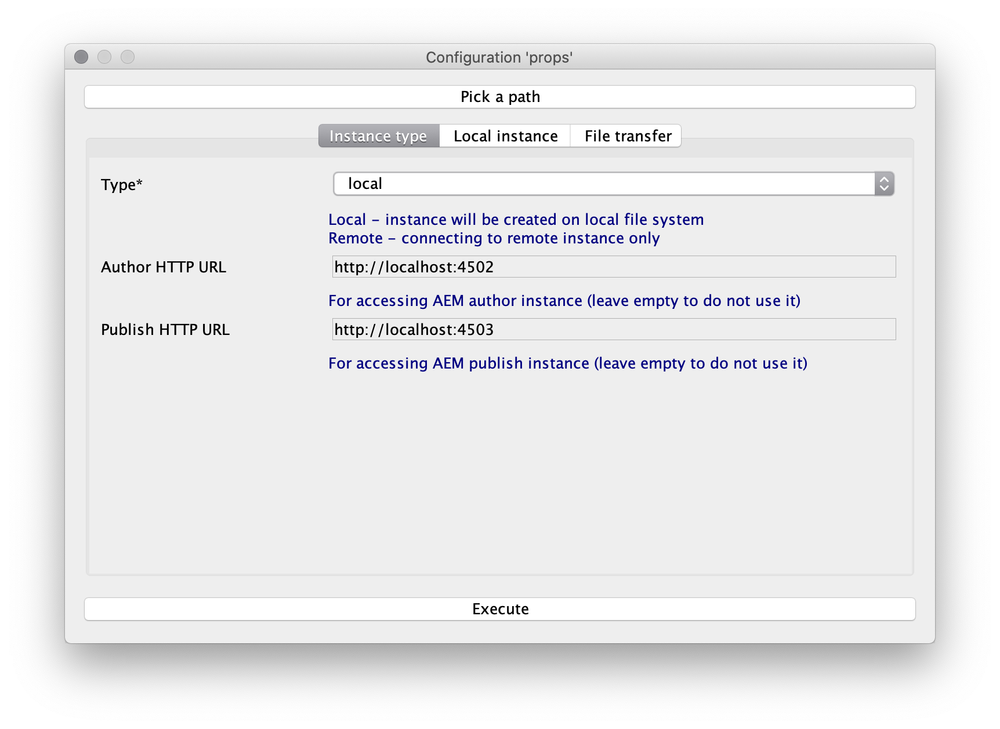

[](https://gradleupdate.appspot.com/Cognifide/gradle-aem-single/status)
[](http://www.apache.org/licenses/)

# AEM Single-Project Example

<br>
<p align="center">
  
</p>
<br>


## Description

This project should be used while starting new project based on AEM.

Documentation for AEM plugin is available in project [Gradle AEM Plugin](https://github.com/Cognifide/gradle-aem-plugin).

## Table of Contents

* [Quickstart](#quickstart)
* [Environment](#environment)
* [Features](#features)
* [Building](#building)
* [Tips &amp; tricks](#tips--tricks)
* [Attaching debugger](#attaching-debugger)
* [Extending build](#extending-build)

## Quickstart

1. Fork project using command:

    ```bash
    git clone git@github.com:Cognifide/gradle-aem-single.git && cd gradle-aem-single && gradlew -i fork
    ```

    and specify properties:

    
    
    and wait until project is forked then enter configured target directory.

2. Setup user specific project configuration using command:

    ```bash
    gradlew -i fork -Pfork.config=setup
    ```
    
    and specify properties:

    

3. Setup local AEM instances and dependencies then build application using command:

    ```bash
    gradlew -i aemSetup
    ```
    
    and wait till complete AEM environment will be ready to use.
  
4. Develop continuously application using command:

    ```bash
    gradlew -i
    ```

## Environment

Tested on:

* Java 1.8
* Gradle 4.4.1
* Adobe AEM 6.3

## Features

* Integrated [Fork Plugin](https://github.com/neva-dev/gradle-fork-plugin) / project generator based on live archetypes.
* Interoperable Java and [Kotlin](https://kotlinlang.org) code examples.
* Integrated popular UI build toolkit: [NodeJS](https://nodejs.org/en/), [Yarn](https://yarnpkg.com) and [Webpack](https://webpack.github.io/) for advanced assets bundling (modular JS, ECMAScript6 transpilation, SCSS compilation with [PostCSS](http://postcss.org), code style checks etc).
* Integrated SCSS compilation on AEM side using [AEM Sass Compiler](https://github.com/mickleroy/aem-sass-compiler).
* Integrated popular AEM testing toolkit: [wcm.io Testing](http://wcm.io/testing).
* Example configuration for embedding OSGi bundles into CRX package (`aemInstall`, `aemEmbed`).
* Example configuration for installing dependant CRX packages on AEM before application deployment (`aemSatisfy`).

## Building

1. Install Gradle
    * Use bundled wrapper (always use command `gradlew` instead of `gradle`). It will be downloaded automatically (recommended).
    * Use standalone from [here](https://docs.gradle.org/current/userguide/installation.html).
2. Run `gradlew idea` or `gradlew eclipse` to generate configuration for your favourite IDE.
3. Build application and deploy using command: `gradlew` <=> `:aemSatisfy :aemDeploy :aemAwait`

## Tips & tricks

* According to [recommendations](https://docs.gradle.org/current/userguide/gradle_daemon.html), Gradle daemon should be: 
    * enabled on development environments,
    * disabled on continuous integration environments.
* If build caches to much, you could try with `--rerun-tasks` option. See this [link](https://docs.gradle.org/current/userguide/gradle_command_line.html) for more details.
* To see more descriptive details about errors, you could use `-i`, `--stacktrace`, `--debug` options.
* To skip tests or any other task by name use `-x test`

## Attaching debugger

1. Execute build with options `-Dorg.gradle.debug=true --no-daemon`, it will suspend,
2. Attach debugger on port 5005,
3. Suspension will be released and build should stop at breakpoint.

## Extending build

For defining new tasks directly in build see:

 * [Build Script Basics](https://docs.gradle.org/current/userguide/tutorial_using_tasks.html)
 * [More about Tasks](https://docs.gradle.org/current/userguide/more_about_tasks.html)

The easiest way to implement custom plugins and use them in project is a technique related with _buildSrc/_ directory.
For more details please read [documentation](https://docs.gradle.org/current/userguide/organizing_build_logic.html#sec:build_sources).
